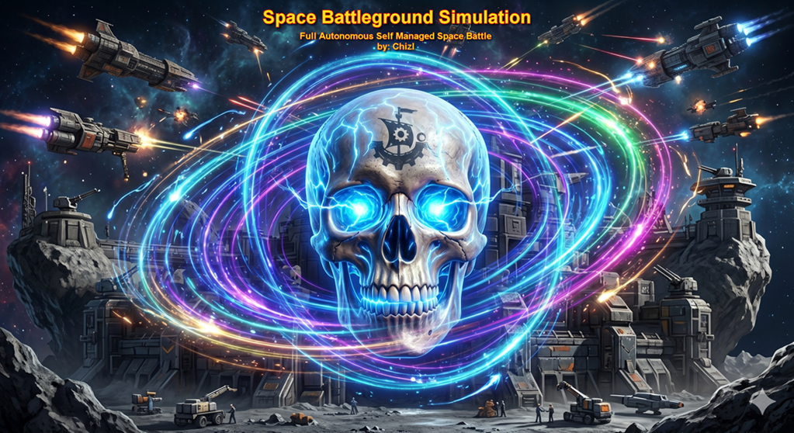
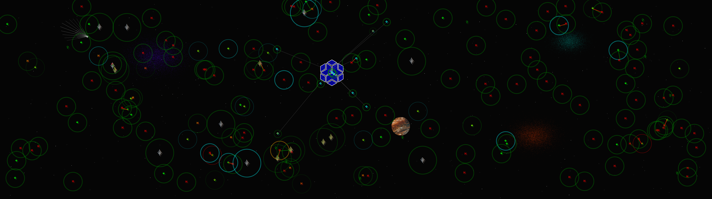


# 

A pure **.NET 8 / WinForms** battlefield simulation that demonstrates how to build real-time 2-D graphics **without any third-party rendering libraries**. Everything you see — nebulae, stars, moving comet, rotating planet, ships, lasers, repair-beams, the grid, shadow effects, and color blending — is drawn directly with `System.Drawing` (`Graphics`, `Pen`, `Brush`, `Font`, Unicode symbols, planet image dynamic resize/wrap for rotation) and EMP blasts.

---

## Table of Contents

- [What It Is](#what-it-is)
- [Features](#features)
- [Ship Types and Default Stats](#ship-types-and-default-stats)
- [Fleet Configuration](#fleet-configuration)
- [Revive / Recovery System](#revive--recovery-system)
- [Architecture](#architecture)
  - [Thread-Safe State](#thread-safe-state)
  - [RepairRig Assignment Dictionary](#repairrig-assignment-dictionary)
- [Controls (Keyboard)](#controls-keyboard)
- [Getting Started](#getting-started)
- [Project Structure](#project-structure)
- [Contributing](#contributing)

---

## What It Is

**SpaceBattleSim** has no interaction except to look at stats.  It spawns a configurable fleet of spaceships dynamically on a dark grid with 3 Nebulae, many stars, a flying comet, rotating planet, and Raiders fighting against Friendly autonomously. Ships move randomly across the canvas, detect enemies inside their *HitBox Radius*, fire lasers, take damage, and either die or get revived by a healer, if friendly. The entire simulation runs with no game engine or graphics framework — it is a showcase of raw WinForms `OnPaint` / `Timer`-driven rendering with zero jumpiness or lag.  The simulation is designed to be visually engaging and strategically dynamic, with the ebb and flow of battle creating emergent moments of triumph and defeat.  The default configuration creates a fast-paced, intense battle where the home team is under constant pressure from the Raiders, and the RepairRigs must work tirelessly to keep them alive.  The visual effects and dynamic color changes add to the immersive experience, making it more than just a technical demo but a captivating space battle simulation.

**Single Monitor - Full Screen**


**All Monitors - Full Screen**<br/>
Config: TotalBattleShips: `150`, ScreenViewType: `FullScreenAll`, ShowMatrixGrid: `True`, ShowStars: `True`, NaturalStarfield: `True`, ShowComet: `False`, ShowNebulae: `true`, ShowPlanets: `False`, ShowVersion: `False`


> Can run by itself or with project in Visual Studio.  Press (F5) at any time to revive all the dead.  This will happen automatically within 15 seconds of all Ally or all Raiders being destroyed, but you can also trigger it manually with F5. The F1 and F2 keys show different levels of ship info overlays.

> AI keeps telling me to do things differently in some places, but any time it's done, it destroys the simulation and rendering doesn't work anymore.  So I have to keep it the way it is, even if it's not how I would do it if I were writing it from scratch.  It's a bit of a mess as there are things I need to break up into other classes/methods, but it works, has no memory leaks, it's fast, and that's the point of the project. — Show how to build a real-time simulation with pure `System.Drawing` without any game engine or rendering framework.

---

## Features

- **Flawless and Pure `System.Drawing` rendering** — no Unity, MonoGame, SkiaSharp, or similar.
- **Space background** — Nebulae, radom Stars, rotating planet, and a flying Comet.  All to make it more of a space simulation.
- **Config Space background** — At the root you will find `SpaceBattleSim.dll.config`.  
  - This file has settings for the space background elements to be visible or not, such as:
    - Nebulae, Stars, Planet, Comet, NaturalStarfield, Version to be `true` or `false`. Total BattleShips (int), Planet Size (int) and Planet Spin Speed (float) can also be configured.
- **100+ ship fleet** — configurable via constants in `BgPlatform.cs`.
- **4 active ship classes** — RepairRig/Healer, Capital Ship, Fighter, Raider — each with unique stats and behavior.
- **Per-ship independent threads** — every ship runs its AI loop on its own background thread.
- **Thread-safe shared state** — a `ConcurrentDictionary` tracks every ship's current position and health, readable by all threads simultaneously.
- **Conflict-free repair assignments** — a second thread-safe dictionary ensures only one RepairRig claims a dead ally at a time.
- **Dynamic color health indicator** — ship color shifts as shields drops as HitBox diameter changes base on power transfer if enabled.
- **Laser and repair-beam rendering** — red laser lines for attacks, blue repair-beam lines for recovery.
- **EMP blast rendering** — visual effects for EMP blasts from RepairRigs that disable Raider ships temporarily.  Only used when RepairRig is currently healing and is attacked directly.
- **F-key HUD overlays** — press Esc to Pause/Unpause, F1 for help, F2 for ship stats, F3 to view live battle stats, F5 to instantly reset all ships back to full health, or F12 to open an Explorer window at the simulation root folder.  Audit logging, if enabled, will show manual reset instead of Ally or Raider win.
- **Unicode ship symbols** — each class is rendered as a distinct Unicode glyph using the Arial font.  Found in [SpaceBattleSim\models\ships\ShipStats.cs](SpaceBattleSim/models/ships/ShipStats.cs).
- **Image ship symbols** — when app.config->`UseUnicodeShips` is set to false, each ShipType as Unicode glyph is rendered as an image on the fly in memory and used for the ships rendering.  Since Unicode uses color blending to show damage, the image rendering is static, but will have an overlay of black and get darker as the ship takes damage instead.
- **Transparent-background mode** — Mouse over the top left title and click to toggle `_transparentBG` and make the grid background transparent and click through.
- **Audit Logging** — All ship actions (Kills, Deaths, Heals, CriticalTransfers, Damage taken at those last moments.) are logged to a file with timestamps for post-simulation analysis.  
  - Audit files are stored in the `.\\audit\\` directory with filenames like `260509_1504.log` (YearMonthDay_HourMin.log).  You can see 3 examples of these audit files found here: [SpaceBattleSim\auditLogs](SpaceBattleSim\auditLogs)

---

## Configuration File `SpaceBattleSim.dll.config`

| ConfigName | Value Type | Default Value | Description |
|---|---|---|---|
| `AuditLogEnabled` | bool | false | Toggle audit logging of ship actions |
| `CriticalTransferAlly` | bool | false | If true, this allows all allies to transfer half their power for 100% to their shields, when their shields drop below 25%. |
| `CriticalTransferRaiders` | bool | false | If true, this allows a raider to transfer half their power for 100% to their shields, when their shields drop below 25%. |
| `DisableAutoLock` | bool | false | If true, disables automatic locking of the Windows and stops screensavers. |
| `NaturalStarfield` | bool | true | Toggle natural starfield background layer vs artificial starfield |
| `PlanetSize` | int | 100 | Diameter of the rotating planet in pixels |
| `PlanetSpinSpeed` | float | 0.1 | Rotation speed of the planet (degrees per frame) |
| `PlanetTextureFile` | string | `.\skins\jupiter-surface.jpg` | File path for the planet texture image (png, jpg, or bmp under `.\skins\`) |
| `RefreshRate` | float | 20 | Frames Per Second (FPS), which will be translated to milliseconds.  This is the time between each frame update, and it can be adjusted to  improve performance on older machines. |
| `ScreenViewType` | string | `FullScreenCurrent` | Default: `FullScreenCurrent` - Full screen.  `FullScreenAll` - Set to FullScreen across all monitors.  `Windowed` - for a resizable window with title bar |
| `ShowComet` | bool | true | Toggle visibility of the flying comet in the background |
| `ShowMatrixGrid` | bool | true | Toggle visibility of the background "Matrix"-style grid |
| `ShowNebulae` | bool | true | Toggle visibility of nebulae background elements |
| `ShowPlanets` | bool | true | Toggle visibility of the rotating planet in the background |
| `ShowStars` | bool | true | Toggle visibility of random stars in the background |
| `ShowVersion` | bool | true | Show the app version near the bottom left of the screen. |
| `TopmostWindow` | bool | false | If true, keeps the window always on top of other windows, unless they are also set to topmost. |
| `TotalBattleShips` | int | 30 | (10-150) Total number of ships (Fighters + Raiders) to spawn in the simulation |
| `UseUnicodeShips` | bool | true | Toggle between Unicode glyphs or auto converts Unicode glyphs to images for ship rendering |
| `UseShadowing` | bool | false | When using Unicode ships, renders a faint shadow behind each ship to improve visibility against the background |


**RefreshRate** Accepted Values:

| FPS | Refresh Rate | IsDefault |
|---|---|---|
| `30` | 33 | No |
| `20` | 50 | Yes |
| `10` | 100 | No |

> **SpaceBattleSim.dll.config** is found at the root of the application.

> **CriticalTransfer** settings enable a risky but powerful last-ditch survival tactic for ships on the brink of destruction. When enabled, if a ship's shields drop below 25%, it can sacrifice half of its remaining firepower to instantly restore its shields to full. This creates dramatic comeback moments and adds strategic depth, as even a heavily damaged ship has a chance to turn the tide of battle with a well-timed transfer. Raiders with this ability become particularly dangerous, as they can survive long enough to unleash devastating counterattacks after recharging their shields.  The firepower cannot drop below 2 for either ally or raiders, so this is a last-ditch move that can be used multiple times per match based on original firepower the each ship.  This means Raiders can use this 4 times, **RepairRigs (Healers) can also use this 4 times** (now matching Raiders with 16 base power), Fighters once, and Capital Ships can use this twice within one battle.

> **Shield Transfer Color**: When a ship performs a critical transfer, the HitBox displayed around the ship changes color.  Based on the amount of times the ship has performed a critical transfer, the color changes to reflect the increasing risk and desperation of the move.  During each of as a shipt takes damage, the color will get dim until it's unable to transfer on the last 25%.  Original power, HitBox is green/25%-red.  Half power, Cyan/25%-DarkOrchid.  Quarter power, Orange/25%-BlueViolet.  Eighth power, Silver/25%-HotPink.

---

## Ship Types and Default Stats

All values are defined in `SpaceBattleSim/models/ships/ShipStats.cs`.

| Ship Type | Shields | Power | Speed | HitBox | Recovery Priority | Notes |
|-----------|---------|-------|-------|--------|-------------------|-------|
| **RepairRig** (Healer) | 400 | **16** | **2.5** | 20 px | **Critical** (1st) | Smallest HitBox, fastest; sole purpose is recovery. Power fuels healing. Auto-renews power at base. |
| **Capital Ship** | **800** | 8 | 0.3 | 75 px | **High** (2nd) | Slowest, Twice Raider shields, but half their power |
| **Fighter** | 400 | 8 | 1.0 | 50 px | **Low** (3rd) | Balanced grunt unit; home-team protector |
| **Raider** (Enemy) | 400 | **16** | 1.5 | 50 px | **None** | Twice Capital Ship power; **never revived** when destroyed; heals via hits, kill bonuses, and group resets |


**Raider combat rules:**

| Rule | Detail |
|------|--------|
| **Glass cannon** | Half the shields (400) of a Capital Ship (800), but twice the firepower (16 vs 8) |
| **Speed advantage** | 5× faster than Capital Ships (1.5 vs 0.3); matches a Fighter's mobility |
| **Smaller range** | Same HitBox as a Fighter (50 px); Capital Ships present a much larger range (75 px) |
| **Heal on hit** | Gain **Current Power / 2 HP** for every hit landed against any allied ship |
| **Kill bonus** | Receive the victim's **(original power * 2) stat as bonus HP** (added to shields, once) when destroying an allied ship — killing a Healer grants 32 HP, killing a Fighter grants 16 HP, etc. |
| **Escalating group reset** | After **50%** of all Raiders have been destroyed, every surviving Raider receives a **full shield and power reset**. The threshold then halves: at **25%** living, another full reset; at **12.5%**, another; and so on, all the way down to **1%** living Raiders. This cascade of resets makes the last surviving Raiders increasingly difficult to finish off. |
| **self-repair** | Heal Only comes between resets — hit bonuses (power/2), kill bonuses (target power*2), and the group reset mechanic |
| **power-restore** | When critical transfer is enabled for Raiders and has already been used, cutting the power in half each time, the power can be restore each time the HP bonus from hits and kills is more than max of the Shields.  Example: Raider used critical transfer twice, so power is at 4 and it's current Shields are at 390.  If the Raider kills a RepairRig, it gets (32*2) bonus HP.  Since the max HP is 400, the overflow 54 plus 30% of max shields (400 x .3) will be the new shields ((54 + (400 x .3)) = 174), but Power will be multiplied by 2, bring the power back to 8.  This can only happen until the power is back to original. |
| **Permanent death** | Never revived by RepairRigs; every Raider loss is final and shifts the battle permanently |
| **Heal priority** | Raiders are never prioritized for healing — RepairRigs ignore them entirely as RepairRigs can be killed by a Raider |
| **Disabled** | Raiders can attack RepairRigs, but if they ever attack while a RepairRig is performing a Heal, the Raider will be disabled by the RepairRig's EMP defensive systems for 5 seconds.  If a EMP is already in effect and the Raider runs into it, the effect to that specific Raider starts then and will last 5 seconds, even if the EMP is no longer active. |

--

> Example of Combat Log Output from the audit log file for a single Fighter under attack by a Raider, showing the damage taken, the critical transfer, the heal, and then the continued attacks until death:

```txt
10:15:59.5536 PM: Fighter_011->UnderAttack - By: Raider_085 (16 dmg). Shields at: 184 (92%)
10:15:59.7104 PM: Fighter_011->UnderAttack - By: Raider_085 (16 dmg). Shields at: 168 (84%)
10:15:59.8783 PM: Fighter_011->UnderAttack - By: Raider_085 (16 dmg). Shields at: 152 (76%)
10:16:00.0491 PM: Fighter_011->UnderAttack - By: Raider_085 (16 dmg). Shields at: 136 (68%)
10:16:00.2229 PM: Fighter_011->UnderAttack - By: Raider_085 (16 dmg). Shields at: 120 (60%)
10:16:00.3810 PM: Fighter_011->UnderAttack - By: Raider_085 (16 dmg). Shields at: 104 (52%)
10:16:00.5397 PM: Fighter_011->UnderAttack - By: Raider_085 (16 dmg). Shields at: 88 (44%)
10:16:00.6998 PM: Fighter_011->UnderAttack - By: Raider_085 (16 dmg). Shields at: 72 (36%)
10:16:00.8583 PM: Fighter_011->UnderAttack - By: Raider_085 (16 dmg). Shields at: 56 (28%)
10:16:01.0163 PM: Fighter_011->CriticalTransfer - Power was: 4, Power now: 2
10:16:01.0163 PM: Fighter_011->Heal - Healed: CritTransfer
10:16:01.1707 PM: Fighter_011->UnderAttack - By: Raider_085 (16 dmg). Shields at: 184 (92%)
10:16:01.3507 PM: Fighter_011->UnderAttack - By: Raider_085 (16 dmg). Shields at: 168 (84%)
10:16:01.5095 PM: Fighter_011->UnderAttack - By: Raider_085 (16 dmg). Shields at: 152 (76%)
10:16:01.6868 PM: Fighter_011->UnderAttack - By: Raider_085 (16 dmg). Shields at: 136 (68%)
10:16:01.8407 PM: Fighter_011->UnderAttack - By: Raider_085 (16 dmg). Shields at: 120 (60%)
10:16:02.0005 PM: Fighter_011->UnderAttack - By: Raider_085 (16 dmg). Shields at: 104 (52%)
10:16:02.1744 PM: Fighter_011->UnderAttack - By: Raider_085 (16 dmg). Shields at: 88 (44%)
10:16:02.3329 PM: Fighter_011->UnderAttack - By: Raider_085 (16 dmg). Shields at: 72 (36%)
10:16:02.4917 PM: Fighter_011->UnderAttack - By: Raider_085 (16 dmg). Shields at: 56 (28%)
10:16:02.6501 PM: Fighter_011->AlmostDead - Last moments are from: Raider_085 (16 dmg). Shields at: 40 (20%)
10:16:02.8031 PM: Fighter_011->AlmostDead - Last moments are from: Raider_085 (16 dmg). Shields at: 24 (12%)
10:16:02.9679 PM: Fighter_011->AlmostDead - Last moments are from: Raider_085 (16 dmg). Shields at: 8 (04%)
10:16:03.1270 PM: Fighter_011->Death - Killed by: Raider_085
```

---

## Fleet Configuration

Default counts are set in `BgPlatform.cs`:

```csharp
// configuration:
const float _percentRepairRigs = 0.10f;     // set percentage of total ships that are repair rigs, rest will be Fighters and Raiders.
const float _percentCapitalShips = 0.10f;   // set percentage of total ships that are capital ships, rest will be Fighters and Raiders.
private int _totalBattleShips = 100;        // pulled from app config, Total number of Fighters and Raiders combined, default 100
private int _capShipCount = 0;              // calculated later, _totalBattleShips / 10, do not modify this here.
private int _repairRigCount = 0;            // calculated later, _totalBattleShips / 10, do not modify this here.
private int _planetSize = 150;              // pulled from app config, diameter of the planet in pixels, default 150
private int _planetWrapWidth = 0;           // calculated later, _planetSize * 2, do not modify this here.
```

The `_totalBattleShips` is split so that **Raiders outnumber Fighters** by roughly 2:1**, creating strong enemy pressure that if 100 total fighters, the 10% more for Healers and 10% more for Capital Ships must balance. The result is a tight, fluctuating battle where either side easily dominates.  The exact numbers can be tweaked by changing the constants, but the default configuration is designed to create a dynamic and engaging simulation.  Currently a fight with 100 fighters, with CriticalTransferRaiders set to true, can last around 10-12 minutes before one side is completely wiped out, at which point the (15sec) auto revive is used or F5 key can be used to revive all the dead and start a new battle.

| Group | Default Count |
|-------|---------------|
| Raiders (enemy) | ~67 |
| Fighters (home team) | ~33 |
| Capital Ships | 10 |
| TowRigs / Healers | 10 |
| **Total ships** | **~120** |

---

## Revive / Recovery System

When a home-team ship's shields reach zero it enters the `Dead` state. RepairRigs scan for dead allies and revive them. The order in which they are prioritized is driven by the `RecoverOrder` enum:

| Priority | Value | Ship |
|----------|-------|------|
| Critical | 4 | RepairRig / Healer — revived first |
| High | 3 | Capital Ship — revived second |
| Low | 1 | Fighter — revived last |
| None | 0 | Raider — **permanent death, never revived** |

RepairRigs are revived first so the recovery pipeline never collapses. Capital Ships follow because of their high combined shield and firepower value. Fighters are last. Raiders are never revived — when destroyed they are gone for the remainder of the session.

### RepairRig (Healer) — Power-Based Healing

RepairRigs now carry **16 power**, matching Raiders, and their power is the fuel for healing rather than combat. Key rules:

| Rule | Detail |
|------|--------|
| **Power-fueled healing** | A healer's power stat is spent to restore shields on a target. Healing a Capital Ship from 0 to full (800 HP) costs the full 800 HP worth of power — even if the healer only has 2 power left after repeated Critical Transfers, it will heal with what it has. |
| **CriticalTransfer parity** | RepairRigs can use Critical Transfer as many times as Raiders (up to 4 times from 16 → 8 → 4 → 2 power), giving them a survival option when under attack. |
| **Auto-renew at base** | When a RepairRig checks in with the home base it **fully restores its power** to 16, keeping it ready for the next healing cycle. |
| **Heal lock — both ships must hold still** | When a RepairRig begins healing or reviving a ship, **both the healer and the target are locked in place** until healing completes. Neither can move during this window. |
| **Simultaneous vulnerability** | Both the healer and the ship being healed can be attacked by enemies during the healing lock. |
| **Damage breaks the lock** | If the **healer takes damage** while healing, it immediately breaks the lock, disengages, and flees. The target ship is released with whatever partial healing it received and must fight on with that amount. |
| **Target fights with partial heal** | A ship released mid-heal retains only the shields restored so far — it does not revert to zero, but it does not receive a full heal either. |

---

## Architecture

### Thread-Safe State

Each `SpaceShip` instance runs its own state on an independent background thread. A shared `ConcurrentDictionary<string, SpaceShip>` (keyed by ship name) allows every thread to read the current position and health of any other ship without locking. This is the foundation of hit-detection and targeting.

```
BgPlatform (UI Thread)
  └── RefreshTimer ──► RefreshTimer_Tick()
                           └── BufferedGraphics.Graphics ──► draws each ship
                                └── Iterates _battleShips list ──► ship.DrawItem(g)
                                └── BufferedGraphics.Render() ──► flips to screen

SpaceShip Thread (× N)
  └── Move ──► scan HitBox ──► attack / repair ──► update shared dictionary entry
```

-	Timer → RefreshTimer
-	Invalidate() removed
-	OnPaint() removed — painting is done directly in the tick handler
-	Added BufferedGraphics.Graphics as the drawing background surface (Stars, Nebulae, and Grid)
-	Added BufferedGraphics.Render() as the final screen flip step
-	ConcurrentDictionary → _battleShips list (that's what's iterated in DrawItem(Graphics))

---

### RepairRig Assignment Dictionary

To prevent multiple RepairRigs from all rushing the same dead ship, a second thread-safe dictionary records *in-progress* repair assignments. Before a RepairRig claims a target it performs an atomic check-and-add. If another RepairRig already holds that entry the current RepairRig skips it and looks for the next unclaimed dead ally.

---

## Controls (Keyboard)

| Key | Action |
|-----|--------|
| **Esc** | Pause / Unpause the simulation |
| **F1** | Show help and F-key reference overlay |
| **F2** | Show ship class summary with live status |
| **F3** | Show live battle statistics overlay |
| **F5** | Revive all currently dead home-team ships |
| **F12** | Open File Explorer at the simulation root folder |
| Hover far top-right | Reveals the close button (full-screen mode only) |
| Click far top-left banner | Toggle transparent background (click-through mode) |

---

## Getting Started

### Prerequisites

- [.NET 8 SDK](https://dotnet.microsoft.com/download/dotnet/8.0)
- Windows OS (WinForms is Windows-only)
- Visual Studio 2022 / 2026 **or** the `dotnet` CLI

### Run via Visual Studio

Open `SpaceBattleSim.sln` and press **F5**.

### Run via CLI

```powershell
cd SpaceBattleSim
dotnet run
```

---

## Project Structure

```
SpaceBattleSim/
├── BgPlatform.cs              # Main form: rendering loop, fleet init, keyboard handling
├── BgPlatform.Designer.cs     # Designer-generated form code
├── Program.cs                 # Entry point
├── models/
│   ├── ships/
│   │   ├── ShipEnums.cs       # ShipType, ShipStatus, ShipMission, ShipRole, RecoverOrder, ActionType enums
│   │   ├── ShipSkins.cs       # Ship skin image loader and Unicode-to-image cache
│   │   ├── ShipStats.cs       # Read-only per-type stat definitions
│   │   └── SpaceShip.cs       # Per-ship state, AI loop, hit-detection, rendering data
│   ├── BattleStats.cs         # Thread-safe battle audit collector and log writer
│   ├── DRectangleF.cs         # Extended RectangleF base for positioned objects
│   ├── DLine.cs               # Line drawing model (laser / repair beams)
│   ├── DShapes.cs             # Shape drawing model (comet and other animated shapes)
│   ├── DText.cs               # Text rendering model
│   └── ItemReq.cs             # Paint request wrapper
├── services/
│   ├── ColorConvert.cs        # Color blending / damage-color utilities
│   ├── Logger.cs              # Simple async thread-safe file logger
│   ├── ModImg.cs              # Unicode text-to-image renderer (Chizl.DrawGraphics)
│   └── SpaceBackground.cs     # Background layer renderer (nebulae, stars, comet, planet)
└── utils/
    ├── AppConfig.cs           # Thread-safe app-config reader/writer with caching
    ├── StaticConfig.cs        # Global UI style constants (colors, pens, brushes, fonts)
    ├── DDefaults.cs           # Drawing defaults (shadow, border, laser pens)
    ├── DPoints.cs             # 2-D geometry helpers (point spacing, Bézier, angles)
    ├── About.cs               # Assembly version helper
    ├── Externs.cs             # P/Invoke declarations (Windows API calls)
    └── atomic/
        ├── ABool.cs           # Atomic boolean (thread-safe flag)
        ├── ADateTime.cs       # Atomic DateTime (thread-safe timestamp)
        └── EventStatus.cs     # Named event flag dictionary
```

---

## Dependencies, no external libraries

| Package | Purpose | Found in... |
|---------|---------|-------------|
| `Chizl.ThreadSupport` | Atomic primitives (`ABool`, `ADateTime`, `EventStatus`) for lock-free thread safety | [`SpaceBattleSim/utils/atomic/`](SpaceBattleSim/utils/atomic/) |
| `Chizl.ColorExtension` | Color manipulation helpers used during dynamic ship color merging | [`SpaceBattleSim/services/ColorConvert.cs`](SpaceBattleSim/services/ColorConvert.cs) |
| `Chizl.Applications` | Application metadata helpers (`About`) | [`SpaceBattleSim/utils/About.cs`](SpaceBattleSim/utils/About.cs) |
| `Chizl.StandAloneLogging` | Async thread-safe file logger | [`SpaceBattleSim/utils/Logger.cs`](SpaceBattleSim/utils/Logger.cs) |

> All dependencies are classes from first-party [Chizl](https://github.com/gavin1970) libraries — no third-party game engines or rendering frameworks are used.

---

## Contributing

Pull requests are welcome. If you would like to add a new ship class, enable the reserved *Bomber* or *Transport* types, or improve the rotation logic for Raiders, please open an issue first to discuss the change.

1. Fork the repository
2. Create a feature branch: `git checkout -b feature/my-change`
3. Commit your changes
4. Push and open a Pull Request against `master`

---

*Built with love and pure `System.Drawing` — no game engine required.*
