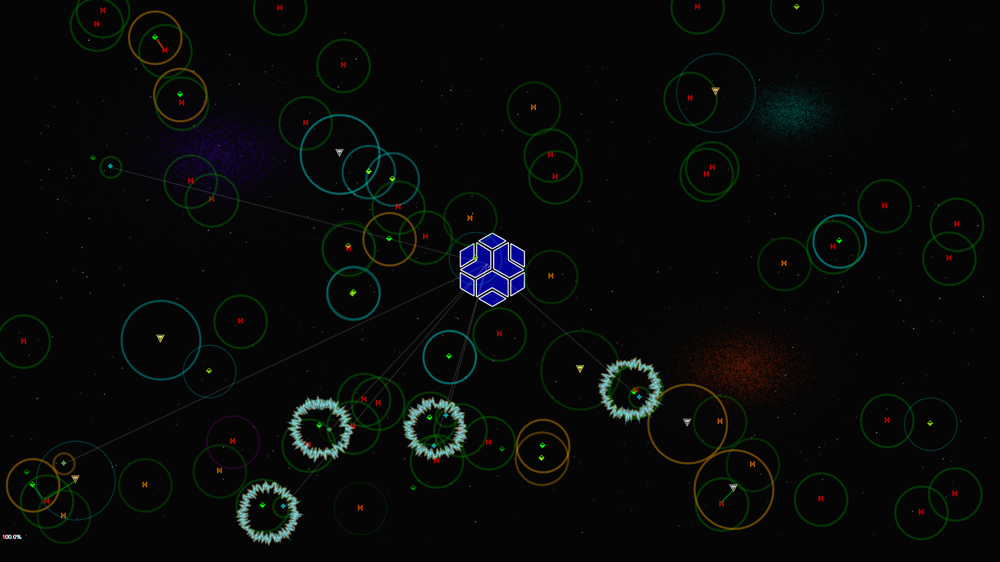

# SpaceBattleSim — Space Battleground Simulation

A pure **.NET 8 / WinForms** battlefield simulation that demonstrates how to build real-time 2-D graphics **without any third-party rendering libraries**. Everything you see — nebulae, stars, moving comet, rotating planet, ships, lasers, repair-beams, the grid, shadow effects, and color blending — is drawn directly with `System.Drawing` (`Graphics`, `Pen`, `Brush`, `Font`, Unicode symbols, planet image dynamic resize/wrap for rotation).

---

## Table of Contents

- [What It Is](#what-it-is)
- [Features](#features)
- [Ship Types and Stats](#ship-types-and-stats)
- [Fleet Configuration](#fleet-configuration)
- [Revive / Recovery System](#revive--recovery-system)
- [Architecture](#architecture)
  - [Thread-Safe State](#thread-safe-state)
  - [RepairRig Assignment Dictionary](#repairrig-assignment-dictionary)
- [Controls (Keyboard)](#controls-keyboard)
- [Getting Started](#getting-started)
- [Project Structure](#project-structure)
- [Dependencies](#dependencies)
- [Contributing](#contributing)

---

## What It Is

**SpaceBattleSim** has no interaction except to look at stats.  It spawns a configurable fleet of spaceships dynamically on a dark grid with 3 Nebulae, many stars, a flying comet, rotating planet, and Raiders fighting against Friendly autonomously. Ships move randomly across the canvas, detect enemies inside their *hitbox radius*, fire lasers, take damage, and either die or get revived by a healer, if friendly. The entire simulation runs with no game engine or graphics framework — it is a showcase of raw WinForms `OnPaint` / `Timer`-driven rendering with zero jumpiness or lag.



> Can run by itself or with project in Visual Studio.  Press (F5) at any time to revive all the dead.  This will happen automatically within 30 seconds of all healers or all raiders being destroyed, but you can also trigger it manually with F5. The F1 and F2 keys show different levels of ship info overlays.

> AI keeps telling me to do things differently in some places, but any time it's done, it destroys the simulation and rendering doesn't work anymore.  So I have to keep it the way it is, even if it's not how I would do it if I were writing it from scratch.  It's a bit of a mess as there are things I need to break up into other classes/methods, but it works, it's fast, and that's the point of the project — to show how to build a real-time simulation with pure `System.Drawing` without any game engine or rendering framework.

---

## Features

- **Flawless and Pure `System.Drawing` rendering** — no Unity, MonoGame, SkiaSharp, or similar.
- **Space background** — Nebulae, radom Stars, rotating planet, and a flying Comet.  All to make it more of a space simulation.
- **Config Space background** — At the root you will find `SpaceBattleSim.dll.config`.  
  - This file has settings for the space background elements to be visible or not, such as:
    - Nebulae, Stars, Planet, Comet, NaturalStarfield, Version to be `true` or `false`. Total BattleShips (int), Planet Size (int) and Planet Spin Speed (float) can also be configured.
- **100+ ship fleet** — configurable via constants in `BgPlatform.cs`.
- **4 active ship classes** — RepairRig/Healer, Capital Ship, Fighter, Raider — each with unique stats and behavior.
- **Per-ship independent threads** — every ship runs its AI loop on its own background thread.
- **Thread-safe shared state** — a `ConcurrentDictionary` tracks every ship's current position and health, readable by all threads simultaneously.
- **Conflict-free repair assignments** — a second thread-safe dictionary ensures only one RepairRig claims a dead ally at a time.
- **Dynamic color health indicator** — ship color shifts as shields drop (green → yellow → orange → red → green tombstone).
- **Laser and repair-beam rendering** — red laser lines for attacks, blue repair-beam lines for recovery.
- **F-key HUD overlays** — press F1/F2 to view live ship stats; press F5 to instantly revive all dead ships.
- **Unicode ship symbols** — each class is rendered as a distinct Unicode glyph using the Arial font.  Found in [SpaceBattleSim\models\ships\ShipStats.cs](SpaceBattleSim/models/ships/ShipStats.cs).
- **Transparent-background mode** — Mouse over the top left title and click to toggle `_transparentBG` and make the grid background transparent and click through.

---

## Configuration File `SpaceBattleSim.dll.config`

| ConfigName | Value Type | Default Value | Description |
|---|---|---|---|
| `ShowNebulae` | bool | true | Toggle visibility of nebulae background elements |
| `ShowStars` | bool | true | Toggle visibility of random stars in the background |
| `ShowNaturalStarfield` | bool | false | Toggle visibility of the natural starfield background layer |
| `ShowPlanet` | bool | true | Toggle visibility of the rotating planet in the background |
| `ShowComet` | bool | true | Toggle visibility of the flying comet in the background |
| `PlanetSize` | int | 300 | Diameter of the rotating planet in pixels |
| `PlanetSpinSpeed` | float | 0.1 | Rotation speed of the planet (degrees per frame) |
| `TotalBattleShips` | int | 120 | Total number of ships (Fighters + Raiders) to spawn in the simulation |
| `ShowVersion` | bool | true | Show the app version near the bottom left of the screen. |
| `CriticalTransferRaiders` | bool | false | If true, this allows a raider to transfer half their power * 50 to their shields, when their shields drop below 25%. |
| `CriticalTransferAlly` | bool | false | If true, this allows all allies to transfer half their power * 50 to their shields, when their shields drop below 25%. |

> **SpaceBattleSim.dll.config** is found at the root of the application.

---

## Ship Types and Stats

All values are defined in `SpaceBattleSim/models/ships/ShipStats.cs`.

| Ship Type | Shields | Power | Speed | Hitbox | Recovery Priority | Notes |
|-----------|---------|-------|-------|--------|-------------------|-------|
| **RepairRig** (Healer) | 400 | 2 | **2.0** | 20 px | **Critical** (1st) | Smallest hitbox, fastest; sole purpose is recovery |
| **Capital Ship** | **800** | 8 | 0.3 | 75 px | **High** (2nd) | Slowest, Twice Raider shields, but half their power |
| **Fighter** | 200 | 4 | 1.0 | 50 px | **Low** (3rd) | Balanced grunt unit; home-team protector |
| **Raider** (Enemy) | 400 | **16** | 1.0 | 50 px | **None** | Twice Capital Ship power; **never revived** when destroyed |
| *Bomber* | 400 | 6 | 0.5 | 60 px | **Medium** | *Reserved — not currently deployed* |
| *Transport* | 2000 | 0 | 2.0 | 40 px | **Low** | *Reserved — not currently deployed* |

> **Raider vs Capital comparison:** Raiders carry twice the firepower (16 vs 8) but only half the shields (400 vs 800), making them glass-cannon enemies.

---

## Fleet Configuration

Default counts are set in `BgPlatform.cs`:

```csharp
// configuration:
int _flierCount    = 100;                 // Total Fighters + Raiders
int _capShipCount  = _flierCount / 10;    // 10 Capital Ships
int _repairRigCount   = _flierCount / 10; // 10 RepairRigs / Healers
```

The `_flierCount` is split so that **Raiders outnumber Fighters** by roughly 2:1**, creating strong enemy pressure that the 10 Healers and 10 Capital Ships must balance. The result is a tight, fluctuating battle where neither side easily dominates.  The exact numbers can be tweaked by changing the constants, but the default configuration is designed to create a dynamic and engaging simulation.  Currently a fight last around 5-10 minutes before one side is completely wiped out, at which point the (30sec) auto revive is used or F5 key can be used to revive all the dead and start a new battle.

| Group | Default Count |
|-------|---------------|
| Raiders (enemy) | ~67 |
| Fighters (home team) | ~33 |
| Capital Ships | 10 |
| TowRigs / Healers | 10 |
| **Total ships** | **~120** |

---

## Revive / Recovery System

When a home-team ship's shields reach zero it enters the `Dead` state. RepairRigs scan for dead allies and revival them. The order in which they are prioritized is driven by the `RecoverOrder` enum:

| Priority | Value | Ship |
|----------|-------|------|
| Critical | 4 | RepairRig / Healer — revived first |
| High | 3 | Capital Ship — revived second |
| Low | 1 | Fighter — revived last |
| None | 0 | Raider — **permanent death, never revived** |

RepairRigs are revived first so the recovery pipeline never collapses. Capital Ships follow because of their high combined shield and firepower value. Fighters are last. Raiders are never revived — when destroyed they are gone for the remainder of the session.

---

## Architecture

### Thread-Safe State

Each `SpaceShip` instance runs its AI on an independent background thread. A shared `ConcurrentDictionary<string, SpaceShip>` (keyed by ship name) allows every thread to read the current position and health of any other ship without locking. This is the foundation of hit-detection and targeting.

```
BgPlatform (UI Thread)
  └── Timer ──► Invalidate() ──► OnPaint()
                    └── Iterates ConcurrentDictionary ──► draws each ship

SpaceShip Thread (× N)
  └── Move ──► scan hitbox ──► attack / repair ──► update shared dictionary entry
```

### RepairRig Assignment Dictionary

To prevent multiple RepairRigs from all rushing the same dead ship, a second thread-safe dictionary records *in-progress* repair assignments. Before a RepairRig claims a target it performs an atomic check-and-add. If another RepairRig already holds that entry the current RepairRig skips it and looks for the next unclaimed dead ally.

---

## Controls (Keyboard)

| Key | Action |
|-----|--------|
| **F1** | Show detailed ship info and stats overlay (hold to keep visible) |
| **F2** | Show summary ship status overlay (hold to keep visible) |
| **F5** | Revive all currently dead home-team ships |
| Hover over title bar | Reveals the close button |

---

## Getting Started

### Prerequisites

- [.NET 8 SDK](https://dotnet.microsoft.com/download/dotnet/8.0)
- Windows OS (WinForms is Windows-only)
- Visual Studio 2022 / 2026 **or** the `dotnet` CLI

### Run via Visual Studio

Open `SpaceBattleSim.sln` and press **F5**.

### Run via CLI

```powershell
cd SpaceBattleSim
dotnet run
```

---

## Project Structure

```
SpaceBattleSim/
├── BgPlatform.cs              # Main form: rendering loop, fleet init, keyboard handling
├── BgPlatform.Designer.cs     # Designer-generated form code
├── Program.cs                 # Entry point
├── models/
│   ├── ships/
│   │   ├── ShipEnums.cs       # ShipType, ShipStatus, ShipMission, RecoverOrder enums
│   │   ├── ShipStats.cs       # Read-only per-type stat definitions
│   │   └── SpaceShip.cs       # Per-ship state, AI loop, hit-detection, rendering data
│   ├── DRectangleF.cs         # Extended RectangleF base for positioned objects
│   ├── DLine.cs               # Line drawing model (laser / repair beams)
│   ├── DText.cs               # Text rendering model
│   └── ItemReq.cs             # Paint request wrapper
├── services/
│   ├── ColorConvert.cs        # color blending / damage-color utilities
│   └── Logger.cs              # Simple async thread-safe file logger
└── utils/
    ├── StaticConfig.cs        # Global UI style constants (colors, pens, brushes, fonts)
    ├── DDefaults.cs           # Drawing defaults (shadow, border, laser pens)
    ├── About.cs               # Assembly version helper
    └── atomic/
        ├── ABool.cs           # Atomic boolean (thread-safe flag)
        ├── ADateTime.cs       # Atomic DateTime (thread-safe timestamp)
        └── EventStatus.cs     # Named event flag dictionary
```

---

## Dependencies, no external libraries

| Package | Purpose | Found in... |
|---------|---------|-------------|
| `Chizl.ThreadSupport` | Atomic primitives (`ABool`, `ADateTime`, `EventStatus`) for lock-free thread safety | [`SpaceBattleSim/utils/atomic/`](SpaceBattleSim/utils/atomic/) |
| `Chizl.ColorExtension` | color manipulation helpers used during dynamic ship color merging | [`SpaceBattleSim/services/ColorConvert.cs`](SpaceBattleSim/services/ColorConvert.cs) |
| `Chizl.Applications` | Application metadata helpers (`About`) | [`SpaceBattleSim/utils/About.cs`](SpaceBattleSim/utils/About.cs) |
| `Chizl.StandAloneLogging` | Async thread-safe file logger | [`SpaceBattleSim/utils/Logger.cs`](SpaceBattleSim/utils/Logger.cs) |

> All dependencies are classes from first-party [Chizl](https://github.com/gavin1970) libraries — no third-party game engines or rendering frameworks are used.

---

## Contributing

Pull requests are welcome. If you would like to add a new ship class, enable the reserved *Bomber* or *Transport* types, or improve the rotation logic for Raiders, please open an issue first to discuss the change.

1. Fork the repository
2. Create a feature branch: `git checkout -b feature/my-change`
3. Commit your changes
4. Push and open a Pull Request against `master`

---

*Built with love and pure `System.Drawing` — no game engine required.*
